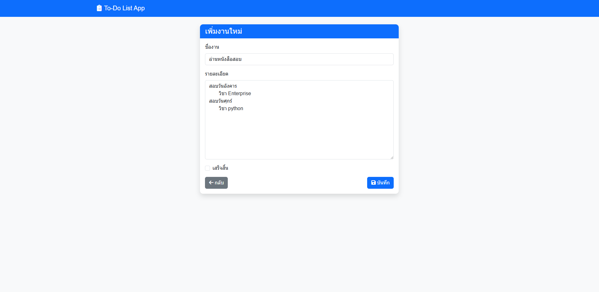
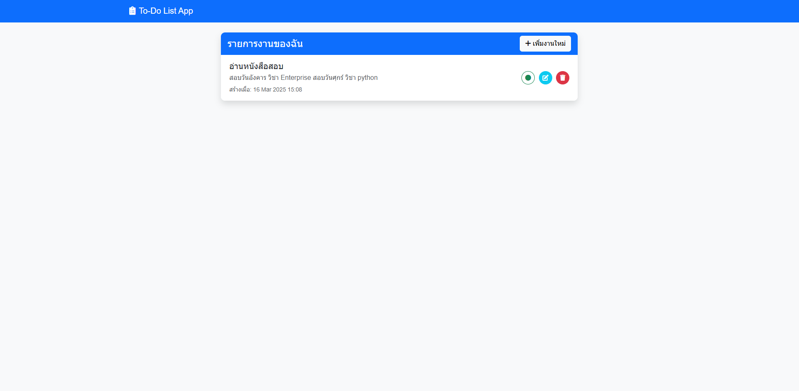

# Todo List App

## 📌 Overview
**Todo List App** is a task management application built with Django. It allows users to create, edit, delete, and mark tasks as completed. The app supports multiple users and provides a clean, easy-to-use interface.

## Website Example




## 🚀 Features
- ✅ Add, edit, delete, and mark tasks as completed
- 📅 Tasks are sorted by the latest created date
- 🎨 UI designed with Bootstrap and Font Awesome
- 🔥 Interactive animations for better user experience

## 📂 Project Structure
```
todo_project/
├── manage.py
├── todo_project/
│   ├── settings.py
│   ├── urls.py
│   └── wsgi.py
├── todo_app/
│   ├── models.py
│   ├── views.py
│   ├── urls.py
│   ├── forms.py
│   ├── templates/
│   │   └── todo_app/
│   │       ├── base.html
│   │       ├── todo_list.html
│   │       └── todo_form.html
│   │       └── todo_confirm_delete.html
│   ├── static/
│   │   └── todo_app/
│   │       ├── css/style.css
│   │       └── js/script.js
└── db.sqlite3
```

## 🛠 Installation
1. **Clone the Repository**  
   ```sh
   git clone https://github.com/Bobby9326/Todo-List-App.git
   cd Todo-List-App
   ```

2. **Create a Virtual Environment and Install Dependencies**  
   ```sh
   python -m venv venv
   source venv/bin/activate   # macOS/Linux
   venv\Scripts\activate      # Windows
   pip install -r requirements.txt
   ```

3. **Set Up the Database and Migrate**  
   ```sh
   python manage.py migrate
   ```

4. **Run the Server**  
   ```sh
   python manage.py runserver
   ```
   Access the app at `http://127.0.0.1:8000/`

## 🖥 Usage
- The home page displays all tasks
- Click `+` to add a new task
- Click `✏️` to edit a task
- Click `🗑️` to delete a task
- Click `✅` to mark a task as completed  

## 📷 Screenshots


## 💡 Future Improvements
- 🔐 Authentication system (Login/Register)
- 📅 Add due dates and notifications
- 📊 Dashboard with task statistics  

## 👨‍💻 Author
[Bobby9326](https://github.com/Bobby9326)  

## 📜 License
This project is licensed under the MIT License.

